<!-- SWITCH -->

  <a href="README.pt.md">🇧🇷 PT</a> • <strong>EN</strong>

<!-- BANNER -->

  

<!-- TYPING -->

  

<!-- PORTFOLIO BUTTON -->

  

---

<h2 align="center">✦ About Me</h2>

🎓 ADS Student @ FIAP  
🎨 Multimedia background   
I create digital experiences that connect  
<b>technology, design and user experience</b>

---

<h2 align="center">✦ Tech Stack</h2>

  

---

<h2 align="center">✦ Design & Creative Tools</h2>

  
  
  
  

---
<h2 align="center">✦ GitHub Insights</h2>

<table align="center">
  <tr>
    <td align="center">
      
    </td>
    <td align="center">
      
    </td>
  </tr>
</table>

  

---

<h2 align="center">✦ What I'm doing</h2>

💻 Full Stack Developer  
📈 Tech + Design projects

---

<h2 align="center">✦ Connect</h2>

  

---

✦ <i>building digital experiences with intention</i>

  

